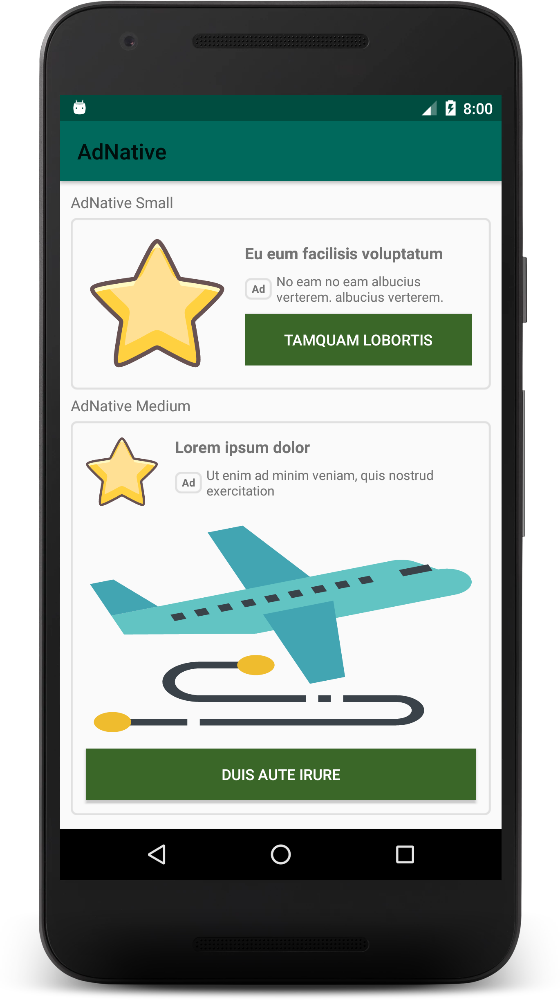

## Android AdNative Templates 

[  ](https://bintray.com/arteaprogramar/Android/arte.programar.adnative/1.0.2/link)

Native ads are ad assets that are presented to users via UI components that are native to the platform.

Using native ads you can customize your ads resulting in a better user experience. Better user experiences can increase engagement and improve your overall yield. 
[Google AdMob](https://developers.google.com/admob/android/native/templates)

## Objective

The library shows custome advertising when your app does not have internet access.
If your app has internet access it will show Google Admob Ad.
## Installation

Include library in your project.

```
dependencies {
    implementation fileTree(dir: 'libs', include: ['*.jar'])
    ...
    implementation 'arte.programar:adnative:1.0'
    implementation 'com.google.android.gms:play-services-ads:19.3.0'
    ...
}

```

## Usage

- Update your AndroidManifest.xml
```
<manifest>
    <application>
        <!-- Sample AdMob App ID: ca-app-pub-3940256099942544~3347511713 -->
        <meta-data
            android:name="com.google.android.gms.ads.APPLICATION_ID"
            android:value="ca-app-pub-xxxxxxxxxxxxxxxx~yyyyyyyyyy"/>
    </application>
</manifest
```

- Initialize Mobile Ads SDK

```
Java
protected void onCreate(Bundle savedInstanceState) {
    super.onCreate(savedInstanceState);
    setContentView(...);

    MobileAds.initialize(this, new OnInitializationCompleteListener() {
        @Override
        public void onInitializationComplete(InitializationStatus initializationStatus) {
        }
    });
}

Kotlin
override fun onCreate(savedInstanceState: Bundle?) {
    super.onCreate(savedInstanceState)
    setContentView(R.layout.activity_main)

    MobileAds.initialize(this) {}
}
```

### Create AdNative Small Custom

activity_main.xml
```
<arte.programar.adnative.AdNativeView
    android:id="@+id/adnative"
    android:layout_width="match_parent"
    android:layout_height="wrap_content"
    app:adt_icon="@drawable/ic_star"
    app:adt_subtitle="No eam no eam albucius verterem. albucius verterem."
    app:adt_template="@layout/adt_small_template_view"
    app:adt_text_button="Tamquam lobortis"
    app:adt_title="Eu eum facilisis voluptatum" />
```

### Create AdNative Small Custom

activity_main.xml
```
<arte.programar.adnative.AdNativeView
    android:id="@+id/adnative"
    android:layout_width="match_parent"
    android:layout_height="wrap_content"
    app:adt_template="@layout/adt_medium_template_view" />
```

### CastView 

MainActivity.java 

```
...
protected void onCreate(Bundle savedInstanceState) {
    ...
    
    AdLoader loader = new AdLoader.Builder(this, ID_NATIVE)
        .forUnifiedNativeAd(new UnifiedNativeAd.OnUnifiedNativeAdLoadedListener() {
            @Override
            public void onUnifiedNativeAdLoaded(UnifiedNativeAd unifiedNativeAd) {
                AdNativeView template = findViewById(R.id.adnative);
                template.setNativeAd(unifiedNativeAd);
            }
        })
        .build();
    
    loader.loadAd(new AdRequest.Builder().build());   

    ...
}
...

```



### Add AdNative Custom (Programmatically)

```

protected void onCreate(Bundle savedInstanceState) {
    ...
    final AdNativeView template = findViewById(R.id.adnative_medium);
    template.createAdMediumCustom(
            "Lorem ipsum dolor",
            "Ut enim ad minim veniam, quis nostrud exercitation",
            "Duis aute irure",
            ContextCompat.getDrawable(getApplicationContext(), R.drawable.ic_star),
            ContextCompat.getDrawable(getApplicationContext(), R.drawable.rectangle)
    );

    AdLoader loader = new AdLoader.Builder(this, ID_NATIVE)
        .forUnifiedNativeAd(new UnifiedNativeAd.OnUnifiedNativeAdLoadedListener() {
            @Override
            public void onUnifiedNativeAdLoaded(UnifiedNativeAd unifiedNativeAd) {
                template.setNativeAd(unifiedNativeAd);
            }
        })
        .build();
    
    loader.loadAd(new AdRequest.Builder().build()); 

    ...
}

```

### Attributes

| Attribute           | Related method(s)        | Parameter          | Default value                     |
|---------------------|--------------------------|--------------------|-----------------------------------|
| app:adt_template    |                          | Layout References  | @layout/adt_small_template_view   |
| app:adt_title       | createAdSmallCustom()  createAdMediumCustom() | String | Arte al Programar        |
| app:adt_subtitle    | createAdSmallCustom()  createAdMediumCustom() | String | Programming is Art. Programming is life. |
| app:adt_text_button | createAdSmallCustom()  createAdMediumCustom() | String | Follow us                |
| app:adt_icon        | createAdSmallCustom()  createAdMediumCustom() | Drawable | Arte al Programar Icon |
| app:adt_cover       | createAdMediumCustom()   | Drawable           | Arte al Programar Cover           |

### Video


### Contributing

Native Templates Android by [Google Developper](https://github.com/googleads/googleads-mobile-android-native-templates)


## License
[Apache 2](https://www.apache.org/licenses/LICENSE-2.0)